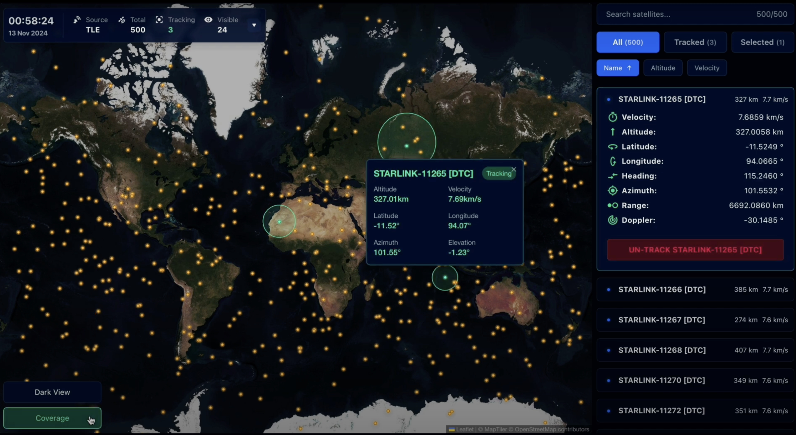
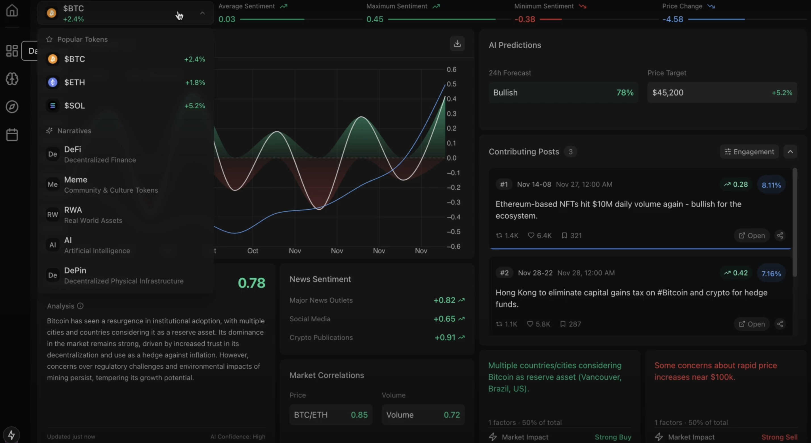

## Hello, I'm Tom 👋

I'm a software engineer from London, passionate about building useful applications.

## About me 👨‍🏭

Since the start of my career in sales honing my skills on the phone, I’ve shifted my focus to software development, aiming to bridge the gap between technical solutions and what truly matters to people and businesses.

## My stack 👨‍🔬

## What I'm working on 👨‍💻

### [Emeris](https://github.com/tomghaines/emeris)  
A satellite tracking platform that visualises orbital data in real-time. Features include live tracking, coverage analysis, and dynamic visualisations, providing an intuitive experience for both casual observers and space enthusiasts.

### [BirdyAI](https://github.com/kayyueth/birdy_ai)
A modern crypto analytics dashboard that converts market sentiment and social signals into actionable insights. It enables users to track narratives, events, and real-time trends in the crypto ecosystem.

### [MetaTX](https://github.com/kayyueth/metatx-crypto-wallet)
A secure crypto wallet Chrome extension for managing digital assets. It offers a user-friendly interface for transactions, wallet management, and streamlined crypto operations.

